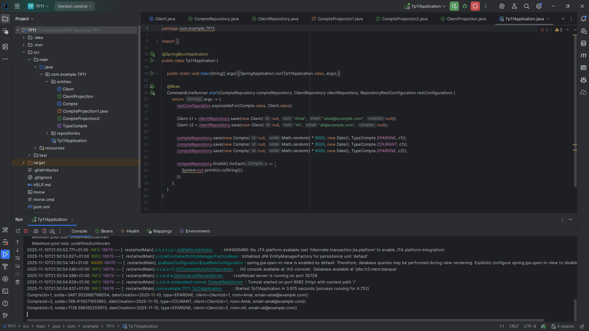
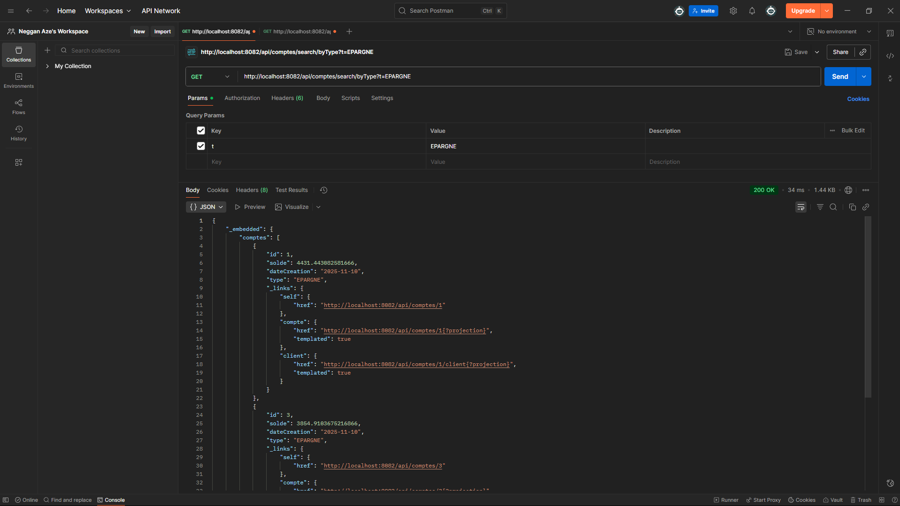
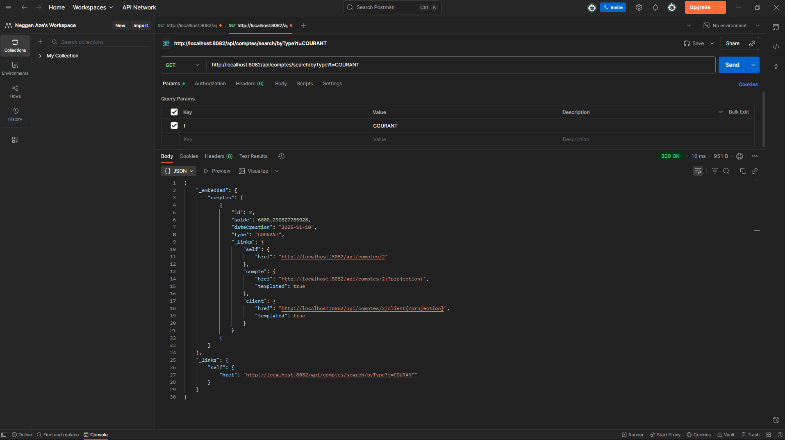

# TP11 - Spring Data REST

## Description
Application Spring Boot utilisant Spring Data REST pour exposer automatiquement des services RESTful pour la gestion de comptes bancaires et de clients.






## Technologies utilisées
- Spring Boot 3.5.7
- Spring Data JPA
- Spring Data REST
- H2 Database (base de données en mémoire)
- Lombok
- Java 21

## Configuration

### Base de données H2
- URL JDBC: `jdbc:h2:mem:banque`
- Console H2: http://localhost:8082/h2-console
- Username: `sa`
- Password: (vide)

### Serveur
- Port: 8082
- Base path API: `/api`

## Entités

### Compte
- `id`: Long (généré automatiquement)
- `solde`: double
- `dateCreation`: Date
- `type`: TypeCompte (COURANT, EPARGNE)
- `client`: Client (relation ManyToOne)

### Client
- `id`: Long (généré automatiquement)
- `nom`: String
- `email`: String
- `comptes`: List<Compte> (relation OneToMany)

## Endpoints REST disponibles

### Comptes

#### Lister tous les comptes
```
GET http://localhost:8082/api/comptes
```

#### Obtenir un compte par ID
```
GET http://localhost:8082/api/comptes/{id}
```

#### Créer un nouveau compte
```
POST http://localhost:8082/api/comptes
Content-Type: application/json

{
    "solde": 5000.0,
    "dateCreation": "2025-11-04",
    "type": "EPARGNE",
    "client": "http://localhost:8082/api/clients/1"
}
```

#### Modifier un compte
```
PUT http://localhost:8082/api/comptes/{id}
Content-Type: application/json

{
    "solde": 6000.0,
    "dateCreation": "2025-11-04",
    "type": "COURANT"
}
```

#### Supprimer un compte
```
DELETE http://localhost:8082/api/comptes/{id}
```

#### Rechercher des comptes par type
```
GET http://localhost:8082/api/comptes/search/byType?t=EPARGNE
GET http://localhost:8082/api/comptes/search/byType?t=COURANT
```

### Clients

#### Lister tous les clients
```
GET http://localhost:8082/api/clients
```

#### Obtenir un client par ID
```
GET http://localhost:8082/api/clients/{id}
```

#### Obtenir les comptes d'un client
```
GET http://localhost:8082/api/clients/{id}/comptes
```

#### Créer un nouveau client
```
POST http://localhost:8082/api/clients
Content-Type: application/json

{
    "nom": "Mohamed",
    "email": "mohamed@example.com"
}
```

## Projections

### Pour les comptes

#### Projection "solde" - Affiche uniquement le solde
```
GET http://localhost:8082/api/comptes/{id}?projection=solde
```

#### Projection "mobile" - Affiche le solde et le type
```
GET http://localhost:8082/api/comptes/{id}?projection=mobile
```

### Pour les clients

#### Projection "clientDetails" - Affiche le nom et l'email
```
GET http://localhost:8082/api/comptes/{id}/client?projection=clientDetails
```

## Pagination et Tri

### Pagination
```
GET http://localhost:8082/api/comptes?page=0&size=2
```

### Tri
```
GET http://localhost:8082/api/comptes?sort=solde,desc
GET http://localhost:8082/api/comptes?sort=dateCreation,asc
```

### Pagination + Tri
```
GET http://localhost:8082/api/comptes?page=0&size=2&sort=solde,desc
```

## Navigation entre ressources

Spring Data REST expose automatiquement les liens HATEOAS pour naviguer entre les ressources :

```
GET http://localhost:8082/api/comptes/1/client    # Obtenir le client d'un compte
GET http://localhost:8082/api/clients/1/comptes   # Obtenir les comptes d'un client
```

## Données de test

Au démarrage, l'application initialise automatiquement :
- 2 clients (Amal et Ali)
- 3 comptes avec des soldes aléatoires associés aux clients

## Démarrage de l'application

```bash
# Avec Maven Wrapper
.\mvnw.cmd spring-boot:run

# Ou compiler puis exécuter
.\mvnw.cmd clean package
java -jar target\TP11-0.0.1-SNAPSHOT.jar
```

## Accès à la console H2

1. Démarrer l'application
2. Ouvrir http://localhost:8082/h2-console
3. Utiliser les paramètres de connexion :
   - JDBC URL: `jdbc:h2:mem:banque`
   - Username: `sa`
   - Password: (laisser vide)

## Structure du projet

```
src/
├── main/
│   ├── java/
│   │   └── com/example/TP11/
│   │       ├── entities/
│   │       │   ├── Client.java
│   │       │   ├── Compte.java
│   │       │   ├── TypeCompte.java
│   │       │   ├── ClientProjection.java
│   │       │   ├── CompteProjection1.java
│   │       │   └── CompteProjection2.java
│   │       ├── repositories/
│   │       │   ├── ClientRepository.java
│   │       │   └── CompteRepository.java
│   │       └── Tp11Application.java
│   └── resources/
│       └── application.properties
└── test/
    └── java/
        └── com/example/TP11/
            └── Tp11ApplicationTests.java
```

## Remarques importantes

- Spring Data REST expose automatiquement les repositories en tant que services RESTful
- Les IDs sont exposés dans les réponses JSON grâce à `exposeIdsFor()`
- Les projections permettent de contrôler les données retournées
- Les méthodes de recherche personnalisées sont automatiquement exposées sous `/search/`
- HATEOAS est activé par défaut pour la navigation entre ressources

